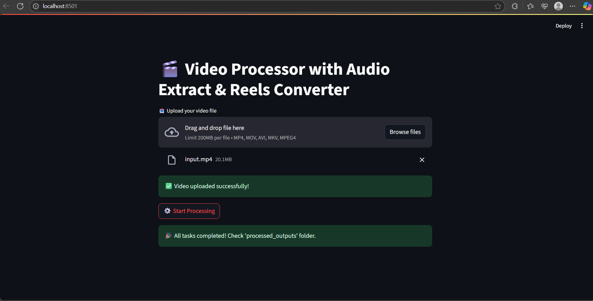
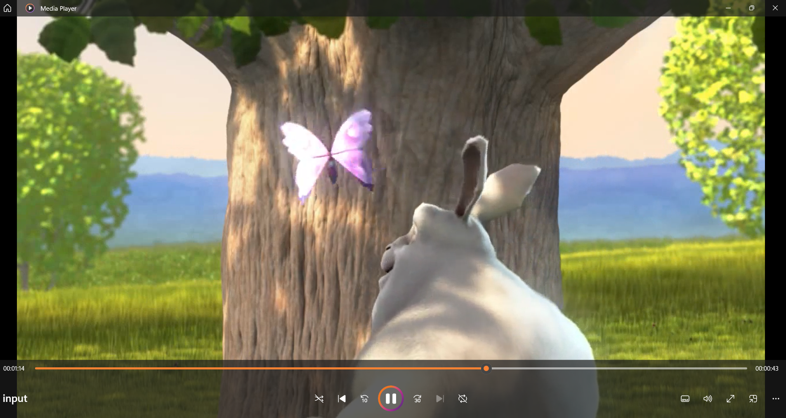
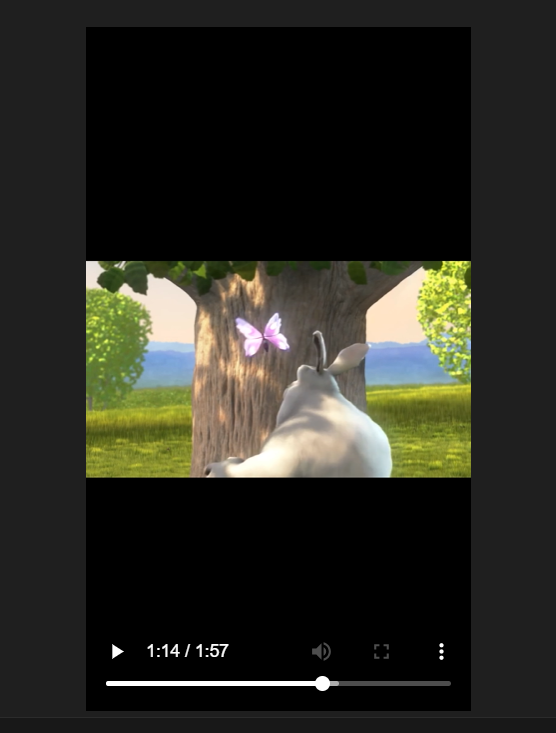
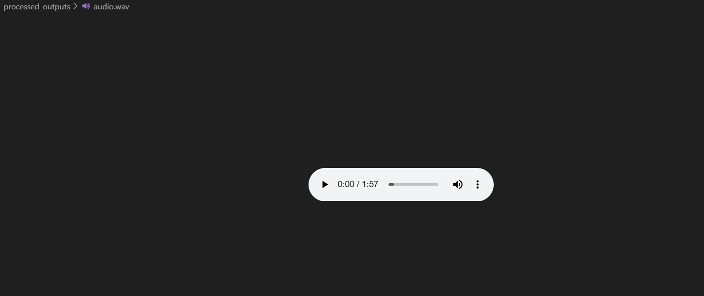

# 🎬 Video Processor with Audio Extract

This project is a simple yet powerful tool built using **Python**, **Streamlit**, and **FFmpeg** that allows users to:

- ✅ Upload full-length videos
- 🎧 Extract audio in `.wav` format
- 📱 Resize the video to **vertical reel format** (1080x1920)
- 🧩 Automatically split long videos into 5-minute chunks

---

## 🚀 Features

- **Audio Extraction**  
  Extracts `.wav` audio from the uploaded video using `ffmpeg`.

- **Reel Format Conversion**  
  Resizes horizontal videos into a vertical 1080x1920 format, suitable for Instagram Reels or YouTube Shorts.

- **Auto Chunking**  
  For videos longer than 10 minutes, automatically splits into 5-minute segments.

- **Streamlit Web Interface**  
  Clean and simple interface for uploading and processing your video.

---

## 🛠 Technologies Used

| Tool       | Purpose                            |
|------------|-------------------------------------|
| `ffmpeg`   | Video & audio processing            |
| `streamlit`| Web-based frontend interface        |
| `Python`   | Scripting backend logic             |
| `ffmpeg-python` | Python wrapper for FFmpeg     |

---

## 🧪 How to Run Locally

### 1️⃣ Clone the repo

```bash
git clone https://github.com/Yogitha-Turumella/Video-Processor-with-audio-extract.git
cd Video-Processor-with-audio-extract
2️⃣ Set up environment
bash
Copy
Edit
python -m venv venv
venv\Scripts\activate  # or source venv/bin/activate (Linux/Mac)
pip install -r requirements.txt
3️⃣ Install FFmpeg (if not already)
Download FFmpeg for Windows

Add ffmpeg/bin/ to your system PATH

Verify installation:

bash
Copy
Edit
ffmpeg -version
4️⃣ Run the Streamlit app
bash
Copy
Edit
streamlit run app.py
📂 File Structure
bash
Copy
Edit
.
├── app.py                # Streamlit UI
├── video_processor.py    # FFmpeg logic (audio, resize, chunk)
├── requirements.txt
├── .gitignore
📸 Screenshots
## 📸 Screenshots

## 📸 Screenshots

### Streamlit UI


### Input Video Screenshot


### Output Video Screenshot


### Audio Output Screenshot



